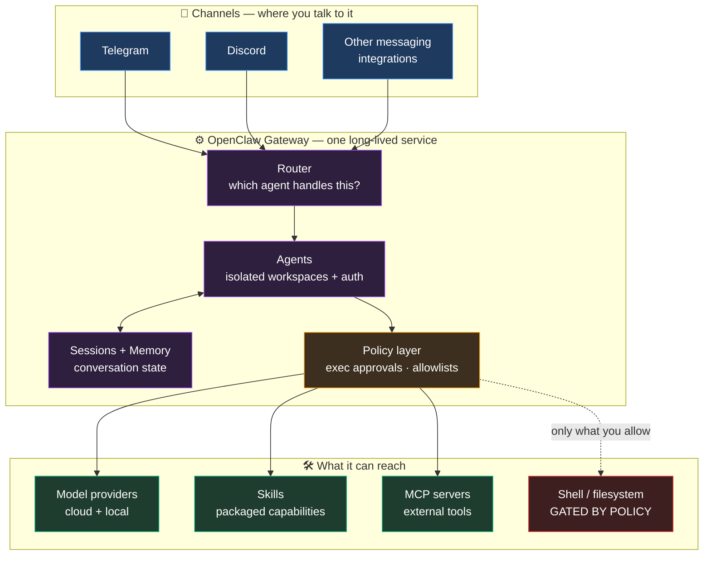

# Dr Non's OpenClaw Set-Up

<p align="center"></p>

> **A field guide to running a multi-channel AI gateway on your own machine.**
> What it is, what it can reach, what it can *do to you* if you set it up
> carelessly — and how to set it up so that it can't.

This is a **learner's guide**, not a fork. [OpenClaw](https://www.npmjs.com/package/openclaw)
is someone else's excellent software; this repo is the map I wish I'd had before
running `npm install -g openclaw` — written after a summer of actually operating
it unattended.

---

## 🤖 Don't have a clue where to start? Let an agent do it.

**Paste this to Claude Code (or any capable coding agent):**

```
Set up OpenClaw on my machine following
https://github.com/Nonarkara/dr-non-openclaw-setup
```

It will clone the repo, find [`AGENTS.md`](AGENTS.md), and work through the
setup — surveying your machine first, installing, locking down security
*before* connecting anything, choosing local models that fit your RAM, and
reporting back what you've got.

**What the agent will not do**, by instruction:

- ❌ Type any credential — it hands the keyboard to you for every key
- ❌ Set the permissive `yolo` exec policy, even to fix an error
- ❌ Expose the gateway beyond `127.0.0.1`
- ❌ Weaken any security control to make a step succeed
- ❌ Install extra tools, models, or MCP servers without asking

It stops and asks at every 🛑 in `AGENTS.md` — those are your decisions, not
its. You stay in control of the parts that matter; it does the tedious parts.

*Prefer to drive yourself? Everything the agent does is in the docs below.*

---

## Read this before you install anything

You are about to install a program that, by design:

- runs a **persistent background service** on your machine
- **reads and sends messages** on your behalf on chat platforms
- can **execute shell commands** on your computer
- holds **API keys** for model providers
- can be reached from **your phone**

That's not a warning against using it — that combination is precisely what
makes it useful. But "AI assistant" undersells it. It is closer to **a service
account with a shell on your laptop that answers to a chat app.** Configure it
like one.

The single most important page in this repo is
**[`docs/03-security.md`](docs/03-security.md)**. If you read one thing, read
that. It covers the three-line hardening that puts you in a defensible position:

```bash
openclaw exec-policy preset cautious   # ask before running commands
openclaw security audit                # find the foot-guns you already have
openclaw sandbox explain               # see the policy that is ACTUALLY in effect
```

---

## What it actually is

**OpenClaw is a gateway.** One long-lived process that sits between your chat
channels, a set of AI models, and your machine's capabilities.



Everything routes through the **policy layer**. That box is the whole security
story: get it right and the rest is upside.

---

## The five-minute mental model

| Concept | What it means | Why you care |
|---|---|---|
| **Gateway** | The always-on service. Everything flows through it. | If it's down, nothing works. If it's exposed, everything is exposed. |
| **Channels** | Telegram, Discord, etc. | Each is an inbound path to your machine. Add deliberately. |
| **Agents** | Isolated workspaces with their own auth + routing | Isolation boundary. One agent per trust level. |
| **Skills** | Packaged capabilities the agent can invoke | Where most real usefulness lives |
| **MCP servers** | External tool providers | Extend reach — and attack surface |
| **Exec policy** | Whether the agent may run shell commands | **The most consequential setting in the product** |
| **Sandbox** | Docker-based isolation for agent execution | The difference between "risky" and "contained" |

---

## Install

**Prerequisites:** Node.js 20+, and Docker if you want sandboxing (you do).

```bash
npm install -g openclaw
openclaw onboard          # guided setup: gateway, workspace, auth, channels
```

Then, before connecting anything to the outside world:

```bash
openclaw exec-policy preset cautious
openclaw security audit
openclaw status
```

`openclaw doctor` diagnoses and repairs most config/gateway/channel problems and
is the right first move whenever something misbehaves.

> **Do not start with `yolo`.** The exec-policy presets are `yolo`, `cautious`,
> and `deny-all`. Start at `cautious`, or `deny-all` if you only want a
> conversational assistant. Move up deliberately, never as a debugging step.

---

## The docs

| Doc | What's in it |
|---|---|
| **[`AGENTS.md`](AGENTS.md)** | **The machine-followable setup procedure.** Hand this repo to an agent and it executes this — with hard rules it must not break and 🛑 stops where you decide |
| [`docs/01-what-you-are-installing.md`](docs/01-what-you-are-installing.md) | An honest inventory of the capabilities and trust decisions you're accepting — read before `npm install` |
| [`docs/02-architecture.md`](docs/02-architecture.md) | How a message becomes an action: request flow, agents, sessions, skills, MCP |
| [`docs/03-security.md`](docs/03-security.md) | Threat model, exec policy, sandboxing, secrets, channel exposure, hardening checklist |
| [`docs/04-operating-it.md`](docs/04-operating-it.md) | Keeping it alive: health checks that don't lie, restart logic that works, alert fatigue, and the failure modes that cost me a summer |
| [`docs/05-local-llm-16gb.md`](docs/05-local-llm-16gb.md) | **Local models on 16GB** — which model for which job, the memory budget nobody mentions, and the three settings (`think`, `num_ctx`, `keep_alive`) that decide whether local inference works at all |
| [`docs/06-essential-tool-calls.md`](docs/06-essential-tool-calls.md) | **Which capabilities to enable, in what order**, tiered by risk — plus the allowlist rule that quietly undoes a "cautious" setup |

---

## Why bother at all

A chat app is the best interface ever built for an assistant. It's on your
phone, it's asynchronous, it has history, notifications, groups, and files. You
already live in it.

What OpenClaw adds is that the thing answering can **do** something: read a
document, run a script, check a service, remember what you told it last week.
The gap between "AI that talks" and "AI that acts" is almost entirely about
whether it has safe, governed access to your actual machine — which is why this
repo spends more words on policy than on prompts.

---

## Credits & scope

- **OpenClaw** is by its own authors — [npm](https://www.npmjs.com/package/openclaw).
  Bugs and features belong upstream, not here.
- This repo is documentation and diagrams only. **No credentials, no private
  configuration, and no personal data appear anywhere in it** — every key,
  token, ID, and path in these docs is a placeholder.
- Corrections welcome. Some of this will drift as OpenClaw evolves; when in
  doubt, `openclaw <command> --help` and `openclaw docs` are the source of
  truth.

*Fork it. Improve it. Make it better. Share it.*
