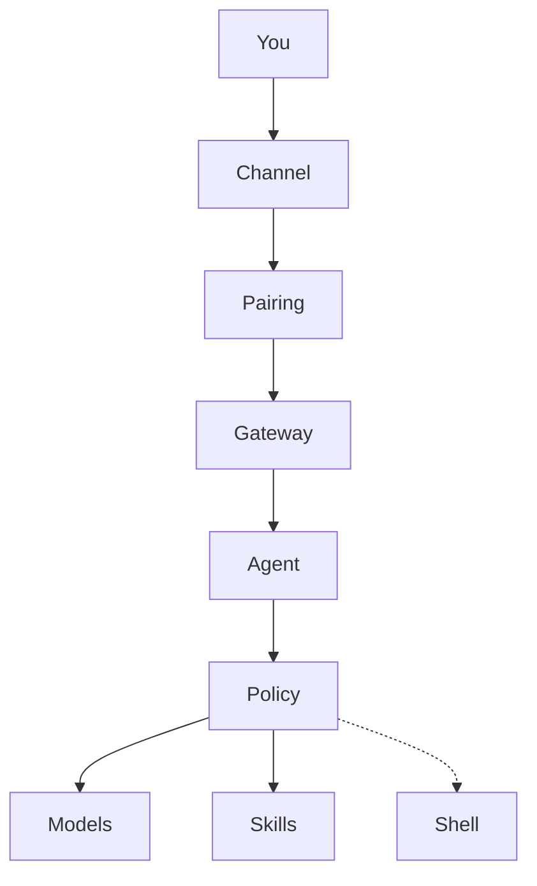

<p align="center">
  
</p>
<p align="center"><em>One desk, one machine, a gateway that asks before it acts — the method is public; the keys stay in your pocket.</em></p>

# Dr Non's OpenClaw Set-Up

**A learner's field guide to running a multi-channel AI gateway on your own machine — useful, and safe by default.**

[](LICENSE)
[](docs/)
[](https://www.npmjs.com/package/openclaw)

By [Non Arkaraprasertkul](https://github.com/Nonarkara) (Nonarkara) — architect, urban anthropologist, and founder of **[Axiom X Co., Ltd.](https://axiom.nonarkara.org)**, a one-desk civic studio in Bangkok.

This repository is independent studio writing. It is **not** an official depa, ASEAN, or municipal product. [OpenClaw](https://www.npmjs.com/package/openclaw) is upstream software; this repo is the map, not a fork of the product. There is no hosted gateway URL here — you run it on **your** machine.

**ไทย / English.** The studio audience is bilingual. This README and the docs are English-first so a fork anywhere can follow the CLI; keep Thai in the work you do with the agent.

---

## What this is

OpenClaw installs a **persistent background service** that sits between your chat apps, a set of AI models, and — if you allow it — a shell on your computer. This repo is the guide I wish I had before `npm install -g openclaw`: what it is, what it can reach, what it can do *to you* if you set it up carelessly, and how to set it up so that it can't.

It is a **learner's guide**, not a product. Bugs and features belong [upstream](https://www.npmjs.com/package/openclaw). What you get here is documentation, diagrams, and a machine-followable setup procedure.

What is in **this** public tree:

| Path | What you actually get |
|---|---|
| [`AGENTS.md`](AGENTS.md) | The setup an agent executes — survey, install, lock down, local models, one channel, sandbox, audit — with hard rules and 🛑 stops that are yours |
| [`CLAUDE.md`](CLAUDE.md) | A short pointer: follow `AGENTS.md`; never type a credential; `cautious` is the floor |
| [`docs/01-what-you-are-installing.md`](docs/01-what-you-are-installing.md) | An inventory of the capabilities you are granting, before you install |
| [`docs/02-architecture.md`](docs/02-architecture.md) | How a message becomes an action, and every gate on that path |
| [`docs/03-security.md`](docs/03-security.md) | Threat model, exec policy, sandbox, secrets, channel exposure, hardening checklist |
| [`docs/04-operating-it.md`](docs/04-operating-it.md) | Keeping it alive unattended: health checks that don't lie, restarts that restart, quiet failure modes |
| [`docs/05-local-llm-16gb.md`](docs/05-local-llm-16gb.md) | Local models on a 16GB machine — which job for which model, and why the RAM number lies |
| [`docs/06-essential-tool-calls.md`](docs/06-essential-tool-calls.md) | Which tools to enable, in what order, tiered by risk |
| [`docs/hero-banner.png`](docs/hero-banner.png) | The illustration at the top of this page |

**This repo is not:**

- A copy of OpenClaw, or a place to file upstream bugs.
- A live hosted gateway, bot, or demo URL. Nothing here is running for you.
- Credentials, private config, personal paths, or a dump of tokens. Every key, ID, and path in these docs is a placeholder.
- A ranking, a dashboard, or a government system.

Related public work: [agentic AI council](https://github.com/Nonarkara/dr-non-agentic-ai-council) (OpenClaw as one engine among several), [offline AI coding](https://github.com/Nonarkara/offline-ai-coding), [live-coding bible](https://github.com/Nonarkara/live-coding-bible).

---

## Philosophy

Four studio tenets. They are how this repo is meant to be forked, not slogans.

**Fork the method, not the secrets.** The method is the order of operations in `AGENTS.md`, the threat model in `docs/03-security.md`, the model picks in `docs/05-local-llm-16gb.md`, and the rule that policy is set *before* any channel can reach the machine. Provider keys, bot tokens, pairing codes, and your config directory are not in this tree. If a learner needs your secrets to follow the guide, the guide failed.

**One Mac.** The notes in `docs/05-local-llm-16gb.md` were taken on a 16GB Apple M3. The gateway is one long-lived process on one desk — not a cluster, not a public tunnel. Remote access is device pairing, not an open port. Bind `127.0.0.1`.

**No black-box rankings.** Exec policy is a named preset you can print (`cautious`, `deny-all`, or — never as a default — `yolo`). Sandbox *effective* policy is what `openclaw sandbox explain` says, not what you intended. A health check that returns success while doing nothing useful is a lie; verify the effect, not the exit code. Nothing here scores cities, people, or models behind a closed formula.

**ไทย / English as the audience.** Civic-studio work on this account is bilingual. Agents should be able to write both. This README stays English-first so an international fork can run the CLI without guessing. Do not invent a Thai translation of a command that is only documented in English, or the reverse.

Company: **Axiom X Co., Ltd.** Author: **Non Arkaraprasertkul** ([Nonarkara](https://github.com/Nonarkara)).

---

## Ethical use

This guide is for **a gateway you own**, used as public-good civic infrastructure or as a personal assistant you can defend. It is not a kit for exposing a control plane, for running unattended shell on a stranger's message, or for pretending a private bot is an official channel.

**Do**

- Set exec policy to `cautious` or `deny-all` **before** connecting a channel. `cautious` asks before a command runs. `deny-all` is a conversational assistant. Both are honest.
- Bind the gateway to loopback. Reach a phone with `openclaw devices` / pairing, not a public port and not a bare tunnel.
- Require approval for inbound DMs (`openclaw pairing`). Anyone who can message the bot can put text in front of the agent.
- Keep provider keys and bot tokens out of git. Use SecretRefs or the operator's environment. Scan before you push.
- Run agents that read untrusted content (web, email, stranger DMs) inside a Docker sandbox when Docker is available. If it isn't, say so — do not pretend the host filesystem is contained.
- Add one channel, one agent, and live with that before adding MCP servers or a second surface.

**Do not**

- Set `exec-policy preset yolo` to "fix" a refused command. A refusal is a finding.
- Bind the gateway beyond `127.0.0.1`, open a public tunnel, or disable a control so a step succeeds.
- Commit API keys, bot tokens, pairing codes, session logs, or a real config directory.
- Imply depa, ASEAN, a municipality, or Axiom X operates the learner's gateway. This repo is a map. The install is theirs.
- Treat these docs as authorization to copy someone else's private OpenClaw workspace.

If a contribution would only work by pasting a secret, it does not belong here.

The single most important page in this repo is [`docs/03-security.md`](docs/03-security.md). If you read one thing, read that.

---

## How to use / learn

Two readers, one tree.

### Let an agent do the tedious parts

Paste this to Claude Code, Cursor, or any capable coding agent:

```
Set up OpenClaw on my machine following
https://github.com/Nonarkara/dr-non-openclaw-setup
```

It will find [`AGENTS.md`](AGENTS.md) and work through the procedure: survey the machine, install, lock down **before** anything inbound, pick local models that fit your RAM, connect one channel only when you say so, then report what you have.

What the agent is instructed **not** to do:

- Type any credential — it hands the keyboard to you
- Set the permissive `yolo` exec policy, even to fix an error
- Expose the gateway beyond `127.0.0.1`
- Weaken a security control to make a step succeed
- Install extra tools, models, or MCP servers without asking

It stops at every 🛑 in `AGENTS.md`. Those are your decisions.

### Or drive it yourself

**Need:** Node.js 20+, roughly 10GB free disk. Docker is strongly recommended (sandboxing). Ollama is optional (local models).

```bash
npm install -g openclaw
openclaw --version

# Policy first — before onboard, before any channel
openclaw exec-policy preset cautious
openclaw exec-policy preset          # must print cautious or deny-all

openclaw onboard                     # you type every secret
```

Then, still before the outside world can reach it:

```bash
openclaw security audit
openclaw status
openclaw sandbox explain             # effective policy, not intent
```

Local models, if you have Ollama and the RAM (see [`docs/05-local-llm-16gb.md`](docs/05-local-llm-16gb.md) before pulling a 12B):

```bash
ollama pull nomic-embed-text         # embeddings
ollama pull qwen3:4b                 # fast text
ollama pull gemma3:4b                # vision
openclaw models scan
openclaw models list
```

One channel, then pairing:

```bash
openclaw channels
openclaw pairing                     # inbound DM approval
openclaw devices                     # paired devices
```

If something misbehaves: `openclaw doctor`, then `openclaw status`, then `openclaw logs`, then `df -h /`. Do not debug by loosening policy.

A setup you can defend on day one: **one channel, one agent, `cautious`, no extra MCP servers.** Add capability when you hit a real limit, not in anticipation of one.

---

## System diagram

A message on your phone becomes an action on your machine only if pairing and policy allow it.



The model *asks*. Policy decides. That split is the safety architecture — setting the preset to `yolo` removes it. Full path, including sandbox and memory: [`docs/02-architecture.md`](docs/02-architecture.md).

---

## License / contributing

[MIT](LICENSE). Copyright © 2026 **Non Arkaraprasertkul / Axiom X Co., Ltd.**

Reuse the prose, diagrams, and procedure with attribution. The grant covers **this repository**. It does not relicense OpenClaw, model weights, chat platforms, or anyone else's credentials.

Corrections welcome. Open a pull request against `main`. Keep the voice: a field guide, not a vendor pitch. Do not add live tokens, private paths, or a second channel "to make the demo richer." Do not weaken a security rule in `AGENTS.md` to make a step easier. When OpenClaw drifts, `openclaw <command> --help` and `openclaw docs` are the source of truth.

If you fork this into a gateway people actually message, read [`docs/03-security.md`](docs/03-security.md) before the first inbound DM.

*Fork the method. Keep the keys. Bind loopback.*
