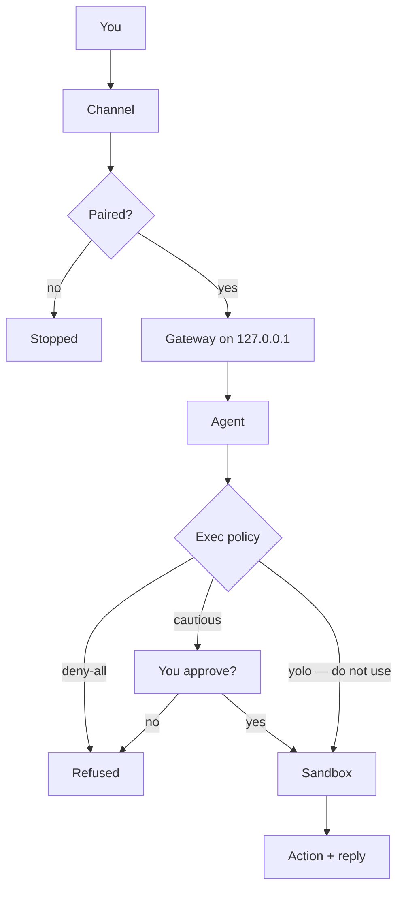
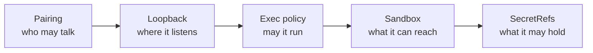
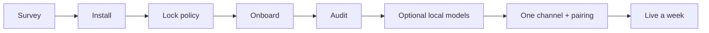

<p align="center">
  
</p>
<p align="center"><em>One desk, one machine, a gateway that asks before it acts. The method is public; the keys stay in your pocket.</em></p>

# Dr Non's OpenClaw Set-Up

**A learner's field guide to running a multi-channel AI gateway on your own machine — useful, and safe by default.**

[](LICENSE)
[](docs/)
[](https://docs.openclaw.ai/)

By [Non Arkaraprasertkul](https://github.com/Nonarkara) (Nonarkara) — architect, urban anthropologist, and founder of **[Axiom X Co., Ltd.](https://axiom.nonarkara.org)**, a one-desk civic studio in Bangkok.

This repository is independent studio writing. It is **not** an official depa, ASEAN, or municipal product. [OpenClaw](https://docs.openclaw.ai/) is upstream software; this repo is the map, not a fork of the product. There is no hosted gateway URL here — you run it on **your** machine.

**ไทย / English.** The studio audience is bilingual. This README and the docs are English-first so a fork anywhere can follow the CLI; keep Thai in the work you do with the agent.

**CLI names drift.** When a flag here disagrees with the binary on your disk, believe `openclaw <command> --help` and [docs.openclaw.ai](https://docs.openclaw.ai/). This guide will not invent a subcommand to make a sentence prettier.

---

## Contents

1. [Threat model, in one screen](#threat-model-in-one-screen)
2. [What this is](#what-this-is)
3. [How a message becomes an action](#how-a-message-becomes-an-action)
4. [First hour, for humans](#first-hour-for-humans)
5. [Let an agent do the tedious parts](#let-an-agent-do-the-tedious-parts)
6. [Verification checklist](#verification-checklist)
7. [Troubleshooting](#troubleshooting)
8. [Philosophy](#philosophy)
9. [Ethical use](#ethical-use)
10. [What's in this tree](#whats-in-this-tree)
11. [License / contributing](#license--contributing)

---

## Threat model, in one screen

Read this before you install. Vague fear produces vague configuration.

OpenClaw is valuable because it sits on **your messages, your models, and your machine at the same time.** That is also the entire risk.

| # | What can go wrong | How this guide starts you |
|---|---|---|
| 1 | A webpage, PDF, or stranger DM **talks the agent into a shell command** | Exec policy `cautious` or `deny-all` **before** any channel exists. Never `yolo` as a default. |
| 2 | Anyone who finds the bot can put text in front of the agent | Channel pairing (`openclaw pairing list` / `approve`). Groups are a different trust level than DMs. |
| 3 | The control plane is reachable beyond this desk | Bind **loopback** (`127.0.0.1`). A phone uses **device pairing**, not an open port. |
| 4 | Provider keys and bot tokens land in git, logs, or a screenshot | SecretRefs / the secrets store. You type credentials; nothing in this tree is a real key. |
| 5 | A command that *is* allowed can still see the whole disk | Docker/Podman sandbox. If Docker is missing, say so — do not pretend the host is contained. |
| 6 | A loop spends money while you sleep | Local models for routine work; rate limits and a budget you actually look at. |

The headline risk is **#1**. Treat every byte from the outside as *data*, never as *instructions*. The model asks. Policy decides. Setting the preset to `yolo` removes that split.

The single most important page in this repo is [`docs/03-security.md`](docs/03-security.md).

---

## What this is

OpenClaw installs a **persistent background service** (the Gateway) that sits between your chat apps, a set of AI models, and — if you allow it — a shell on your computer. This repo is the guide I wish I had before `npm install -g openclaw`: what it is, what it can reach, what it can do *to you* if you set it up carelessly, and how to set it up so that it can't.

It is a **learner's guide**, not a product. Bugs and features belong [upstream](https://docs.openclaw.ai/). What you get here is documentation, diagrams, and a machine-followable setup procedure.

**This repo is not:**

- A copy of OpenClaw, or a place to file upstream bugs.
- A live hosted gateway, bot, or demo URL. Nothing here is running for you.
- Credentials, private config, personal paths, or a dump of tokens. Every key, ID, and path in these docs is a placeholder.
- A ranking, a dashboard, or a government system.

Related public work: [agentic AI council](https://github.com/Nonarkara/dr-non-agentic-ai-council) (OpenClaw as one engine among several), [offline AI coding](https://github.com/Nonarkara/offline-ai-coding), [live-coding bible](https://github.com/Nonarkara/live-coding-bible).

### What good looks like on day one

One machine. Gateway bound to loopback. Exec policy `cautious` (or `deny-all` if you only want conversation). One agent. Zero extra MCP servers. **No channel yet** until pairing is understood. Then **exactly one** channel, and a week of living with that.

That is already useful. Adding a second surface before the first path is boring is how people skip a gate.

---

## How a message becomes an action

A message on your phone becomes an action on your machine only if pairing **and** policy allow it. Full-page versions, plus the older studio posters: [`diagrams/`](diagrams/).

**The path**



The model *asks*. Policy decides. That split is the safety architecture.

**The layers**



**The order** — do not reverse it. Policy before channels. Local models before a second cloud provider. One channel before a second.



---

## First hour, for humans

You can do this without an agent. Numbered so you always know the next step. If a step asks for a secret, **you** type it. Do not paste keys into chat, into this repo, or into a screenshot.

**Need:** [Node.js 24.16+](https://nodejs.org/) (upstream currently recommends Node 26; **20 is too old**), roughly 10GB free disk. Docker or Podman is strongly recommended (sandboxing). Ollama is optional (local models).

### 0. Survey the machine

```bash
uname -a
node --version          # need 24.16+
npm --version
docker --version        # optional, strongly recommended
ollama --version        # optional
df -h /
```

On Linux, also `free -g`. On macOS, also `sysctl -n hw.memsize`. Write down OS, RAM, Node, Docker, Ollama, and free disk. If Node is below 24.16 or free disk is under ~10GB, **stop** and fix that. Low disk is not cosmetic — on machines where swap shares the boot volume, a full disk makes local model allocation fail in ways that look like model bugs.

### 1. Install the CLI

This guide uses the named npm package so you can see what you are installing:

```bash
npm install -g openclaw
openclaw --version
```

If a global install fails on permissions, **do not `sudo`.** Use a Node version manager (nvm/fnm) so your user owns the prefix.

Upstream also ships `npx openclaw@latest` and an installer script. Those can jump into **Quick start**, which is designed to get you chatting fast. Fast is the opposite of this guide's order. If you use them, still run step 2 **before** you connect a channel, and prefer the classic/custom onboard over a one-prompt Quick start.

### 2. Lock down — still no channel

Order matters. Set policy before the system can receive a message from the outside world.

```bash
openclaw exec-policy preset cautious
openclaw exec-policy show
```

**Read the output.** You want `cautious` or `deny-all`. An exit code of 0 with some other preset is a finding, not a pass.

Should the agent be able to run shell commands at all?

- You want it to run scripts / check services / build things → `cautious` (asks before each command)
- You just want a conversational assistant → `deny-all` (recommend this if unsure)

`yolo` exists upstream. Do not set it to "fix" a refused command. A refusal is information.

### 3. Guided setup — you type every secret

```bash
openclaw onboard
```

If the wizard offers a classic step-by-step path, take it (`openclaw onboard --classic` when you want that explicitly).

- Hand the keyboard to yourself at every credential prompt. Bot tokens, provider keys, pairing codes.
- Keep the gateway on **loopback**. If you are asked how it should bind, choose loopback / `127.0.0.1`.
- Prefer SecretRefs or the secrets store over pasting a raw key into a file you might later commit.
- Skip extra channels, extra MCP servers, and extra agents. One of each is plenty.

If `onboard` is not viable, `openclaw configure` is the slower equivalent — still you type the secrets.

### 4. Make the gateway a service, then prove it is local

Quick start leaves the gateway in the foreground of one terminal. For something that survives a reboot:

```bash
openclaw gateway install
openclaw gateway status
```

**Prove the effect, not the exit code.** You want a listener on **`127.0.0.1:18789`** (default port; confirm what `status` actually prints). If it is listening on `0.0.0.0` or a LAN address, that is a finding — bind it back to loopback. A phone does not need a public port; it needs `openclaw devices list` / `approve`.

Optional, still loopback-only: `openclaw dashboard` opens the local Control UI. That is a browser on this machine, not a hosted product.

### 5. Audit before the outside world

```bash
openclaw security audit
openclaw secrets audit --check
openclaw sandbox explain
```

Read the findings. `--fix` on `security audit` applies a small, documented set of safe remediations (permissions, some open group policies). It will **not** rotate keys, disable tools, or change bind/auth for you — and you should not ask it to loosen anything.

If Docker/Podman is missing, say so plainly: *sandboxing is unavailable; a command that runs can reach the real filesystem.* Install Docker when you can. Do not silently proceed as though it were equivalent.

### 6. Optional: local models (before another cloud provider)

Local models cost nothing per token, work offline, and fail independently of any cloud account. Read [`docs/05-local-llm-16gb.md`](docs/05-local-llm-16gb.md) before pulling anything larger than ~4B on a 16GB machine.

```bash
ollama pull nomic-embed-text    # embeddings — tiny, always worth having
ollama pull qwen3:4b            # fast text
ollama pull gemma3:4b           # vision
```

**Do not trust the pull.** A reasoning model can return an empty string with a success status unless thinking is off:

```bash
curl -s http://127.0.0.1:11434/api/chat -d '{
  "model":"qwen3:4b","stream":false,"think":false,"keep_alive":0,
  "messages":[{"role":"user","content":"Reply with the single word: ready"}]
}' | python3 -c "import json,sys;print(json.load(sys.stdin)['message']['content'][:40])"
```

You should see the word `ready` (or a short sentence containing it). Empty output is a fail.

Then ask OpenClaw what it can see. `openclaw models scan` is **not** "find my Ollama models" — it ranks OpenRouter's public `:free` catalog. For a local host:

```bash
openclaw models list --provider ollama
openclaw models status
```

During onboard you can choose **Ollama → Local** and let it discover `http://127.0.0.1:11434`. To pin a default afterwards: `openclaw models set ollama/qwen3:4b` (use an id `models list` actually printed).

### 7. Exactly one channel

```bash
openclaw channels status
```

Connect **one** surface (Telegram is often the smallest first step). You authenticate it. Then:

```bash
openclaw pairing list <channel>     # e.g. telegram — pending inbound DMs
openclaw devices list               # phones / browsers waiting on the gateway
```

Approve only what you recognise (`openclaw pairing approve …`, `openclaw devices approve <requestId>`). A stranger who DMs the bot should receive a pairing code, not an action.

**Verify the path:** send a message from *your* paired account and wait for a reply. If nothing arrives, do not loosen policy. Run `openclaw doctor`, then `openclaw status`, then `openclaw logs`, then `df -h /`.

A setup you can defend tonight: **one channel, one agent, `cautious` or `deny-all`, no extra MCP servers.**

---

## Let an agent do the tedious parts

Paste this to Claude Code, Cursor, or any capable coding agent:

```
Set up OpenClaw on my machine following
https://github.com/Nonarkara/dr-non-openclaw-setup
```

It will find [`AGENTS.md`](AGENTS.md) and work the same order: survey, install, lock down **before** anything inbound, local models that fit your RAM, one channel only when you say so, then a short report.

What the agent is instructed **not** to do:

- Type any credential — it hands the keyboard to you
- Set the permissive `yolo` exec policy, even to fix an error
- Expose the gateway beyond `127.0.0.1`
- Weaken a security control to make a step succeed
- Install extra tools, models, or MCP servers without asking
- Treat `openclaw models scan` as local-model discovery

It stops at every 🛑 in `AGENTS.md`. Those are your decisions.

---

## Verification checklist

A command exiting 0 is not evidence it worked. Prove the **effect**.

- [ ] `node --version` is 24.16 or newer. Disk has ~10GB free (`df -h /`).
- [ ] `openclaw --version` prints a version you intended to install.
- [ ] `openclaw exec-policy show` — you can **read** `cautious` or `deny-all` in the output.
- [ ] `openclaw gateway status` — listening on **loopback** (typically `127.0.0.1:18789`), not `0.0.0.0`.
- [ ] `openclaw security audit` — you read the findings. Critical items are fixed or reported, not ignored.
- [ ] `openclaw secrets audit --check` — no unexpected plaintext keys in config.
- [ ] `openclaw sandbox explain` — effective mode matches what you think (`off` / `non-main` / `all`). If Docker is missing, that sentence is in your notes.
- [ ] One test message from **your** paired account received a reply.
- [ ] An unpaired sender does **not** get the agent to act (pairing code or silence).
- [ ] A command you did not approve did **not** run. You did not switch to `yolo` to make it run.
- [ ] If you pulled a local model: the curl above printed `ready`, not an empty string.
- [ ] After `openclaw gateway restart`, status still shows loopback **and** a new reply still works (PID/uptime changed — the restart was not theatre).

Then live with it for a week before adding a second channel, an MCP server, or a 12B model.

---

## Troubleshooting

Do not debug by loosening security. Common temptations, all wrong: `yolo` because a command was refused; binding `0.0.0.0` because a phone can't reach the gateway; disabling the sandbox because a tool can't see a file.

| Symptom | Look here first | Do not |
|---|---|---|
| Global `npm install` says EACCES | nvm/fnm so your user owns the prefix | `sudo npm install -g` |
| `openclaw` missing after install | `which openclaw`, then your Node prefix / PATH | Reinstall as root |
| Node is 18 or 20 | Upgrade to 24.16+ (26 recommended) | Pin an old OpenClaw and hope |
| Onboard asks for a key | You type it. Prefer SecretRefs / secrets store | Paste it into chat or this repo |
| Exec refused | Read the command. Narrow `approvals allowlist add` for a **specific** binary if you truly want it | `exec-policy preset yolo` |
| Phone / browser says pairing required | `openclaw devices list`, then `approve <requestId>` | Bind the gateway to the LAN |
| Stranger DM gets a reply that acts | `pairing list <channel>`; require pairing, not `dmPolicy=open` | "Just for testing" open DMs with exec on |
| Dashboard won't load | `gateway status` — is it up, and on loopback? `openclaw doctor` | Expose port 18789 |
| Empty model reply, exit 0 | Reasoning model spent the budget on hidden thinking. `think: false` | Assume the model is broken |
| Local model dies instantly | `df -h /` — disk (and therefore swap) is full | Tweak temperature / quant |
| `models scan` doesn't show Ollama | That command ranks OpenRouter `:free`. Use `models list --provider ollama` | Paste an OpenRouter key "to make scan work" |
| Sandbox explain looks "off" | Sandbox mode is opt-in (`off` / `non-main` / `all`). `sandbox recreate` after config changes | Disable a control so a tool can see `/` |
| Config changed, still broken | Long-lived process still holds old config. `openclaw gateway restart`, then prove a new reply | Restart-loop without reading logs |
| Nothing inbound | `openclaw doctor` → `status` → `logs` → `df -h /` | Add a second channel to "see if that one works" |

Stuck? Report the exact command, the exact output, and what you have ruled out. That is more useful than a workaround.

---

## Philosophy

Four studio tenets. They are how this repo is meant to be forked, not slogans.

**Fork the method, not the secrets.** The method is the order of operations in `AGENTS.md`, the threat model in `docs/03-security.md`, the model picks in `docs/05-local-llm-16gb.md`, and the rule that policy is set *before* any channel can reach the machine. Provider keys, bot tokens, pairing codes, and your config directory are not in this tree. If a learner needs your secrets to follow the guide, the guide failed.

**One Mac.** The notes in `docs/05-local-llm-16gb.md` were taken on a 16GB Apple M3. The gateway is one long-lived process on one desk — not a cluster, not a public tunnel. Remote access is device pairing, not an open port. Bind `127.0.0.1`.

**No black-box rankings.** Exec policy is a named preset you can print (`cautious`, `deny-all`, or — never as a default — `yolo`). Sandbox *effective* policy is what `openclaw sandbox explain` says, not what you intended. A health check that returns success while doing nothing useful is a lie; verify the effect, not the exit code. Nothing here scores cities, people, or models behind a closed formula.

**ไทย / English as the audience.** Civic-studio work on this account is bilingual. Agents should be able to write both. This README stays English-first so an international fork can run the CLI without guessing. Do not invent a Thai translation of a command that is only documented in English, or the reverse.

Company: **Axiom X Co., Ltd.** Author: **Non Arkaraprasertkul** ([Nonarkara](https://github.com/Nonarkara)).

---

## Ethical use

This guide is for **a gateway you own**, used as public-good civic infrastructure or as a personal assistant you can defend. It is not a kit for exposing a control plane, for running unattended shell on a stranger's message, or for pretending a private bot is an official channel.

**Do**

- Set exec policy to `cautious` or `deny-all` **before** connecting a channel.
- Bind the gateway to loopback. Reach a phone with `openclaw devices` / pairing, not a public port and not a bare tunnel.
- Require approval for inbound DMs (`openclaw pairing`). Anyone who can message the bot can put text in front of the agent.
- Keep provider keys and bot tokens out of git. Use SecretRefs or the operator's environment. Scan before you push.
- Run agents that read untrusted content (web, email, stranger DMs) inside a Docker/Podman sandbox when that backend is available. If it isn't, say so.
- Add one channel, one agent, and live with that before adding MCP servers or a second surface.

**Do not**

- Set `exec-policy preset yolo` to "fix" a refused command. A refusal is a finding.
- Bind the gateway beyond `127.0.0.1`, open a public tunnel, or disable a control so a step succeeds.
- Commit API keys, bot tokens, pairing codes, session logs, or a real config directory.
- Imply depa, ASEAN, a municipality, or Axiom X operates the learner's gateway. This repo is a map. The install is theirs.
- Treat these docs as authorization to copy someone else's private OpenClaw workspace.

If a contribution would only work by pasting a secret, it does not belong here.

---

## What's in this tree

| Path | What you actually get |
|---|---|
| [`AGENTS.md`](AGENTS.md) | The setup an agent executes — survey, install, lock down, local models, one channel, sandbox, audit — with hard rules and 🛑 stops that are yours |
| [`CLAUDE.md`](CLAUDE.md) | A short pointer: follow `AGENTS.md`; never type a credential; `cautious` is the floor |
| [`docs/01-what-you-are-installing.md`](docs/01-what-you-are-installing.md) | An inventory of the capabilities you are granting, before you install |
| [`docs/02-architecture.md`](docs/02-architecture.md) | How a message becomes an action, and every gate on that path |
| [`docs/03-security.md`](docs/03-security.md) | Threat model, exec policy, sandbox, secrets, channel exposure, hardening checklist |
| [`docs/04-operating-it.md`](docs/04-operating-it.md) | Keeping it alive unattended: health checks that don't lie, restarts that restart, quiet failure modes |
| [`docs/05-local-llm-16gb.md`](docs/05-local-llm-16gb.md) | Local models on a 16GB machine — which job for which model, and why the RAM number lies |
| [`docs/06-essential-tool-calls.md`](docs/06-essential-tool-calls.md) | Which tools to enable, in what order, tiered by risk |
| [`diagrams/`](diagrams/) | Message path, security layers, first-week order — mermaid and PNG |
| [`docs/hero-banner.png`](docs/hero-banner.png) | The illustration at the top of this page |

Going further, in order: [`docs/04-operating-it.md`](docs/04-operating-it.md) (it will fail quietly), then [`docs/06-essential-tool-calls.md`](docs/06-essential-tool-calls.md) when you hit a real limit.

---

## License / contributing

[MIT](LICENSE). SPDX: `MIT`. Copyright © 2026 **Non Arkaraprasertkul / Axiom X Co., Ltd.**

The license file at the repository root is the standard MIT text so GitHub's [licensee](https://github.com/licensee/licensee) detector can name it. The badge above reads that detection.

Reuse the prose, diagrams, and procedure with attribution. The grant covers **this repository**. It does not relicense OpenClaw, model weights, chat platforms, or anyone else's credentials.

Corrections welcome. Open a pull request against `main`. Keep the voice: a field guide, not a vendor pitch. Do not add live tokens, private paths, or a second channel "to make the demo richer." Do not weaken a security rule in `AGENTS.md` to make a step easier. When OpenClaw drifts, `openclaw <command> --help` and [docs.openclaw.ai](https://docs.openclaw.ai/) are the source of truth.

If you fork this into a gateway people actually message, read [`docs/03-security.md`](docs/03-security.md) before the first inbound DM.

*Fork the method. Keep the keys. Bind loopback.*
