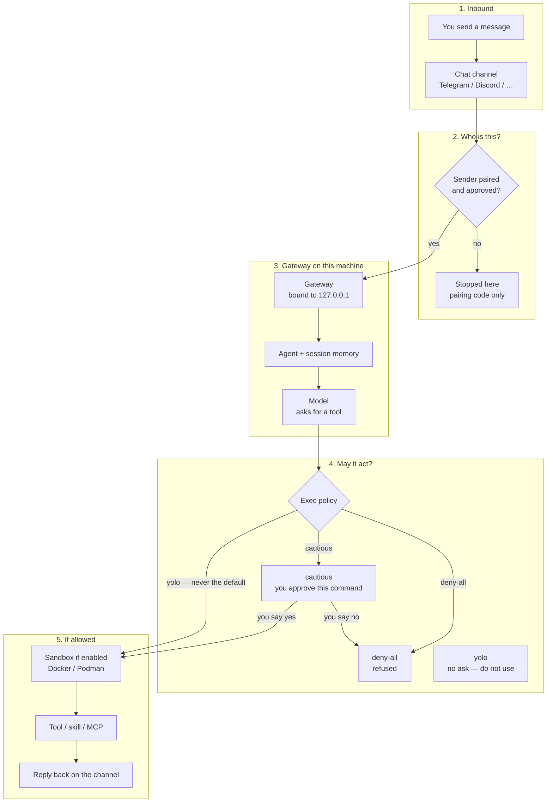
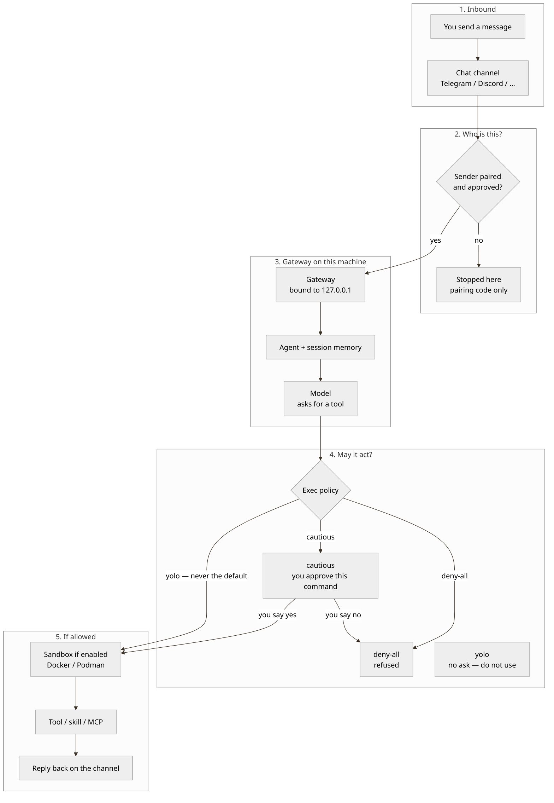
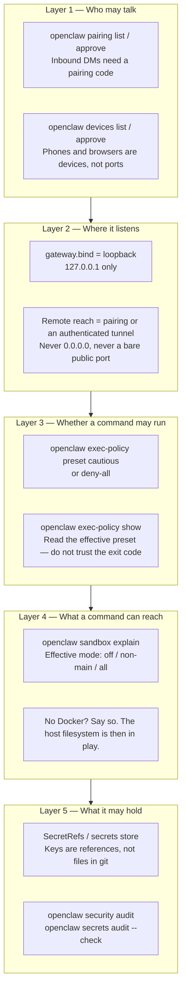
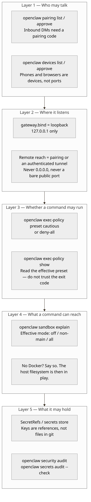
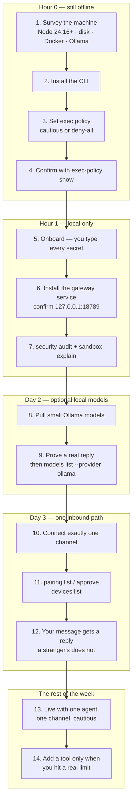
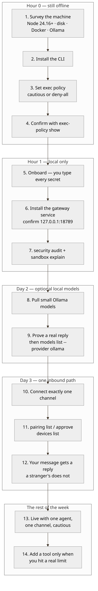

# Diagrams

Three maps of the same system. Prefer these over the older posters in this folder.

| File | What it answers |
|---|---|
| [Message path](#a-message--gates--action) | How a chat message becomes an action — and where you can still say no |
| [Security layers](#b-security-layers) | Pairing, loopback, exec policy, sandbox, SecretRefs — in that order |
| [First week](#c-first-week-order) | What to do in the first hour, then the rest of the week |

Mermaid sources (for rendering or editing): [`message-path.mmd`](message-path.mmd), [`security-layers.mmd`](security-layers.mmd), [`first-week.mmd`](first-week.mmd).

PNG renders of the same three maps sit beside the sources when present (`message-path.png`, `security-layers.png`, `first-week.png`). If a PNG and the mermaid disagree, **the mermaid is the contract**.

The older studio posters [`banner.png`](banner.png) and [`banner-cyberpunk.png`](banner-cyberpunk.png) are illustrations, not setup instructions. They are not a live UI. Do not treat slogans on those posters as policy.

---

## A. Message → gates → action

A stranger's paragraph is **data**. It is not permission. The model *asks* to run a command; exec policy decides.

Two pairing surfaces, not one:

- **Channel pairing** (`openclaw pairing list` / `approve`) — who may DM the bot
- **Device pairing** (`openclaw devices list` / `approve`) — which phone or browser may talk to the gateway

Prose: [`docs/02-architecture.md`](../docs/02-architecture.md).

---

## B. Security layers

Each layer fails closed. Skipping one to “make a step work” is how quiet incidents start.

`yolo` is a named preset upstream. This guide never recommends it as a default. Its habitat is a disposable container you would delete without blinking.

Prose: [`docs/03-security.md`](../docs/03-security.md).

---

## C. First-week order

Policy is set **before** anything inbound exists. That is the whole method.

Humans: the numbered first-hour in the [README](../README.md#first-hour-for-humans). Agents: [`AGENTS.md`](../AGENTS.md).
