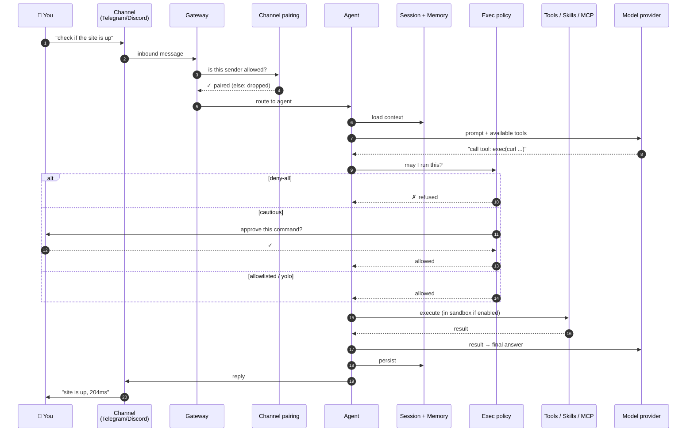
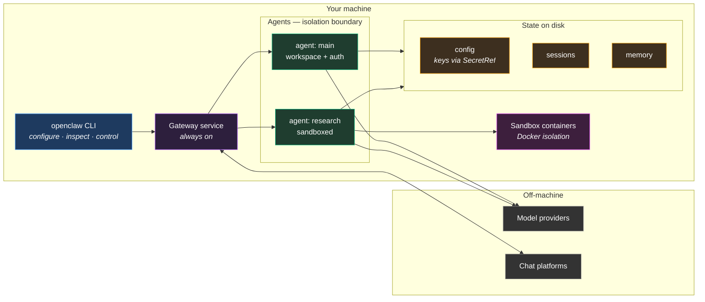
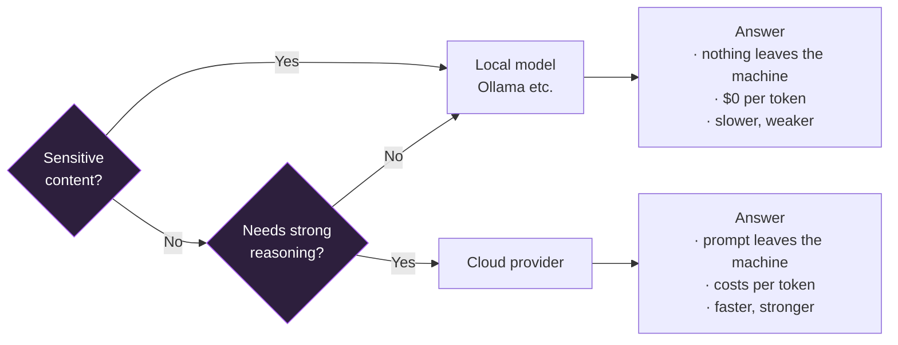

# 02 — Architecture

> How a message on your phone becomes an action on your machine — and every
> place you can intervene along the way.

---

## The request path

This is the diagram worth understanding. Every security control in
[`03-security.md`](03-security.md) is a gate somewhere on this path.



**Note the policy step.** The model *asks* to run a command; it does not run
one. The policy layer decides. That separation is the whole safety
architecture — which is why setting the policy to `yolo` isn't a convenience
tweak, it's removing the architecture.

Two pairing surfaces sit on this path, and newcomers mix them up:

| Surface | Command | Question it answers |
|---|---|---|
| Channel pairing | `openclaw pairing list <channel>` / `approve` | Who may DM the bot? |
| Device pairing | `openclaw devices list` / `approve <requestId>` | Which phone or browser may talk to the gateway? |

A larger, labelled version of this path: [`diagrams/README.md`](../diagrams/README.md#a-message--gates--action).

---

## Components



### Gateway

One long-lived process; everything flows through it. Inspect it with:

```bash
openclaw status     # gateway, channels, models, recent sessions
openclaw health     # detailed health from the running gateway
openclaw logs       # tail logs, locally or over RPC
```

Because it's a service, it survives reboots — which is what makes it useful and
also what makes "I forgot it was running" possible. It is doing things when you
aren't watching.

### Agents

The isolation boundary, and the design lever most people ignore. Each agent has
its own workspace, auth, and routing.

**Use one agent per trust level, not one agent for everything.** A "research"
agent that reads the open web should be sandboxed and unable to touch your
repos. A "dev" agent with repo access shouldn't be reading arbitrary web pages.
Merging them creates the exact path prompt injection needs.

```bash
openclaw agents        # manage workspaces, auth, routing
openclaw sessions      # stored conversations
```

### Skills

Packaged capabilities the agent can invoke — where most day-to-day usefulness
lives.

```bash
openclaw skills list
openclaw skills install <name>
```

A skill is code that runs on your machine. Read one before installing it, the
same way you'd read a shell script off the internet.

### MCP servers

The Model Context Protocol lets the agent call tools hosted elsewhere.

```bash
openclaw mcp           # manage MCP config and the channel bridge
```

Each server is a **privilege grant**. List its tools before adding it.

### Memory and sessions

Sessions hold conversation state; memory persists across them.

```bash
openclaw memory        # search, inspect, reindex
openclaw sessions      # list stored conversations
```

Two consequences worth planning for: memory files are **searchable records of
things you told it**, so treat them with the sensitivity of the source; and
sessions grow, so they need occasional pruning.

---

## Where to intervene

A cheat-sheet mapping "I want to control X" to the actual command:

| You want to control… | Command |
|---|---|
| Whether commands run at all | `openclaw exec-policy preset <deny-all\|cautious>` then `show` |
| Which specific commands are pre-approved | `openclaw approvals allowlist add <pattern>` / `openclaw approvals get` |
| What a command can reach when it runs | `openclaw sandbox explain` (mode is `off` / `non-main` / `all`) |
| Who may DM the bot | `openclaw pairing list <channel>` / `approve` |
| Which phone or browser may talk to the gateway | `openclaw devices list` / `approve <requestId>` |
| Which models get used | `openclaw models list`, `openclaw models set …` |
| What background jobs exist | `openclaw cron`, `openclaw tasks` |
| What it remembers | `openclaw memory`, `openclaw sessions` |
| Whether config is sane | `openclaw security audit`, `openclaw secrets audit --check`, `openclaw doctor` |

`yolo` is a real upstream preset. This table omits it on purpose — it is not a
control you should be reaching for. Confirm whatever you set with
`openclaw exec-policy show`.

---

## Local vs cloud models



A practical pattern: **cloud as primary, local as fallback.** It keeps working
when a provider rate-limits you at 3am — with one caveat learned the hard way:
if every fallback in your chain is a *free tier*, you don't have redundancy,
you have one failure mode wearing several hats. A local model is the only rung
whose failure is genuinely independent.

```bash
openclaw models list
openclaw models list --provider ollama    # local host, after Ollama is up
openclaw models status
```

`openclaw models scan` ranks OpenRouter's public `:free` catalog. It is not
how you register a model you just `ollama pull`'d.
