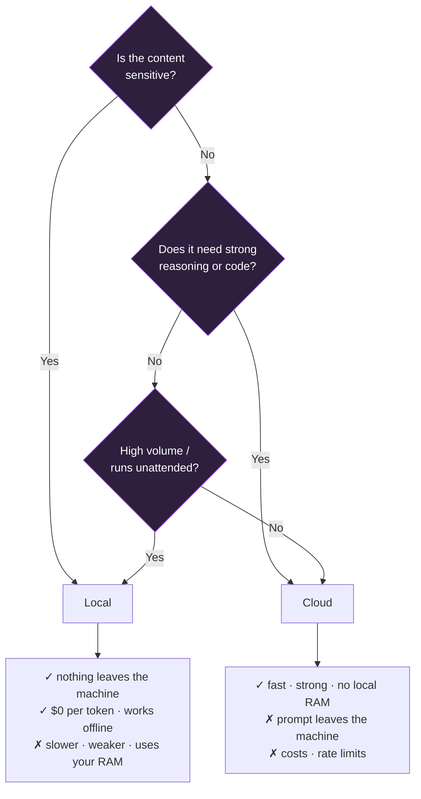

# 05 — Local LLMs on 16GB (and why the number lies)

> Which model for which job, on a machine that cannot run everything at once.
> Benchmarked and broken on a **16GB Apple M3** — the numbers below are from
> that machine, not from a spec sheet.

---

## The budget nobody tells you about

On Apple Silicon, CPU and GPU share **one unified memory pool**. There is no
separate VRAM, which sounds like good news and isn't: your model competes
directly with macOS, your browser, your editor, and every background service.

Realistic accounting on a 16GB Mac:

| Consumer | Typical |
|---|---|
| macOS + WindowServer | ~3–4 GB |
| Browser with real tabs | ~1–2 GB |
| Editor / IDE | ~1–2 GB |
| Everything else you forgot | ~1 GB |
| **Left for a model** | **≈ 8 GB, optimistically** |

And the model file size is not the whole cost. You also pay for the **KV
cache**, which scales with context length. A 7.6GB model at a large context can
want 10GB+ in practice.

> **The failure mode is not a clean out-of-memory error.** It's swap. And on a
> Mac, swap lives on the boot volume — so a memory problem becomes a *disk*
> problem, and a full disk becomes a *model* problem. I lost a day to local
> generation dying instantly with `Remote end closed connection`. Every
> model-side theory was wrong: the disk was at 1.4GB free, so swap couldn't
> grow, so the KV-cache allocation failed. Freeing disk fixed "the model bug".
>
> **Check `df -h /` before you touch model parameters.**

---

## The picks, by purpose

Sizes are the on-disk quantised size as reported by `ollama list` on the test
machine.

| Purpose | Model | Size | Why this one |
|---|---|---|---|
| **Embeddings** | `nomic-embed-text` | **0.3 GB** | Cheap enough to keep resident permanently. Get this first — it makes search and memory work. |
| **Fast text** — routing, summarising, drafting | `qwen3:4b` | **2.5 GB** | The workhorse. Fast, leaves room for everything else. Most tasks don't need more. |
| **Vision** — screenshots, photos, diagrams | `gemma3:4b` | **3.3 GB** | Gemma 3 is natively multimodal — no separate vision encoder. Verified: sent it a red PNG, got "Red". |
| **Best general assistant that fits** | `gemma4:12b` | **7.6 GB** | Genuinely good, and genuinely tight. See the warning below. |
| **Coding** | — | — | Be honest: the good local coders (devstral 24B, gpt-oss 20B) want ~14GB+. On 16GB they run, badly, and only if nothing else does. Use a cloud model for code. |

```bash
ollama pull nomic-embed-text   # always
ollama pull qwen3:4b           # always
ollama pull gemma3:4b          # if you want vision
ollama pull gemma4:12b         # only if you'll close other apps
```

### The 12B warning

`gemma4:12b` at 7.6GB fits *on paper*. What actually happened on the test
machine: running it alongside a text-to-speech service pushed the system into
swap, swap grew onto a nearly-full boot disk, and both services became
unresponsive — while every health check still reported "healthy".

Use the 12B when it's the **only** heavy thing running. If you have a pipeline
where a model hands off to something else memory-hungry, **evict it explicitly**
between stages rather than trusting the runtime's keep-alive:

```bash
curl -s http://127.0.0.1:11434/api/chat \
  -d '{"model":"gemma4:12b","messages":[],"keep_alive":0}'
```

---

## Three settings that decide whether local models work

### 1. `think: false` on reasoning models

Reasoning models (the qwen3 family among them) spend their token budget on
hidden reasoning and return an **empty visible answer** — with a success status
and exit code 0. Nothing errors. You just get nothing.

```jsonc
{ "model": "qwen3:4b", "think": false, "options": { "num_predict": 4000 } }
```

The short test passes without this. Only a real, full-size prompt exposes it.

### 2. `num_ctx` — the setting with two opposite failure modes

Default context is small (~4k on many setups). Feed it a 40k-character prompt
and it **silently truncates** — no error, no warning, just a confident answer
based on a fraction of your input.

But raising it costs memory: the KV cache grows with context, and that's
exactly the allocation that fails on a 16GB box.

```jsonc
{ "options": { "num_ctx": 16384 } }   // set deliberately, not maximally
```

If you must shrink the window, **shrink the prompt yourself.** Server-side
truncation cuts from wherever it likes — in one case it removed the closing
output-format instructions, so the model returned unusable prose instead of the
required structure.

### 3. `keep_alive` — the setting that silently eats your RAM

By default a runtime keeps a model resident for minutes after a call. That is
good for throughput and terrible for a shared 16GB machine.

The trap worth naming: a **health check on a 5-minute schedule that runs real
inference will keep a 3GB model resident permanently.** I built exactly that
monitor, and it starved the very service it was meant to protect. Two model
workers, 3.1GB, held by nothing but health checks.

```jsonc
{ "keep_alive": 0 }   // in probes and one-shot calls
```

---

## Local vs cloud: pick per task, not per ideology



**The pattern that survives contact with reality:** cloud as primary, local as
last resort.

With one hard-won caveat. If every rung of your fallback chain is a *free
cloud tier*, you do not have redundancy — you have **one failure mode wearing
several hats**, because free tiers rate-limit at the same times. That cost me
24 consecutive failed overnight runs. A local model is the only rung whose
failure is genuinely independent of the others.

```
primary (cloud) → alternate (cloud) → LOCAL   ← the only independent rung
```

---

## Verify a model actually works

Never trust `ollama pull`. Trust a reply.

```bash
# text
curl -s http://127.0.0.1:11434/api/chat -d '{
  "model":"qwen3:4b","stream":false,"think":false,"keep_alive":0,
  "messages":[{"role":"user","content":"Reply with the single word: ready"}]
}' | python3 -c "import json,sys;print(json.load(sys.stdin)['message']['content'][:40])"
```

```bash
# vision — expects "Red"
python3 - <<'PY'
import base64, json, struct, urllib.request, zlib
def png(w,h,rgb):
    raw=b''.join(b'\x00'+bytes(rgb)*w for _ in range(h))
    ck=lambda t,d:struct.pack('>I',len(d))+t+d+struct.pack('>I',zlib.crc32(t+d)&0xffffffff)
    return (b'\x89PNG\r\n\x1a\n'+ck(b'IHDR',struct.pack('>IIBBBBB',w,h,8,2,0,0,0))
            +ck(b'IDAT',zlib.compress(raw))+ck(b'IEND',b''))
b64=base64.b64encode(png(64,64,(220,30,30))).decode()
body=json.dumps({"model":"gemma3:4b","stream":False,"keep_alive":0,
  "messages":[{"role":"user","content":"What single colour fills this image? One word.","images":[b64]}]}).encode()
r=urllib.request.Request("http://127.0.0.1:11434/api/chat",data=body,
  headers={"Content-Type":"application/json"})
print(json.loads(urllib.request.urlopen(r,timeout=600).read())["message"]["content"].strip())
PY
```

A cold model load on a busy 16GB machine can take **minutes**, not seconds. Set
client timeouts accordingly — a 120s timeout tuned for cloud latency will
report a perfectly healthy local model as broken.

---

## Monitoring your memory

```bash
# free pages (macOS) — under ~200MB means you are already swapping
vm_stat | awk 'NR==2{printf "free: %.0f MB\n", $3*16384/1048576}'

# swap — if "used" is large and growing, something needs to close
sysctl -n vm.swapusage

# what a runtime is holding right now
curl -s http://127.0.0.1:11434/api/ps
```

If `api/ps` shows a model you aren't using, evict it. On this class of machine
that is often the difference between a working pipeline and a wedged one.

---

## Sources

- [Best Ollama Models 2026, ranked by VRAM](https://www.morphllm.com/best-ollama-models)
- [Best 16GB RAM Local LLMs in 2026](https://ai-jupyter.com/local-ai-models/best-local-llm-for-16gb-ram)
- [Best Ollama Models for Apple Silicon 2026](https://www.promptquorum.com/local-llms/best-models-apple-silicon-2026)
- [Best LLM for a 16GB Mac — what actually runs well](https://willitrunai.com/blog/best-llm-for-16gb-mac)
